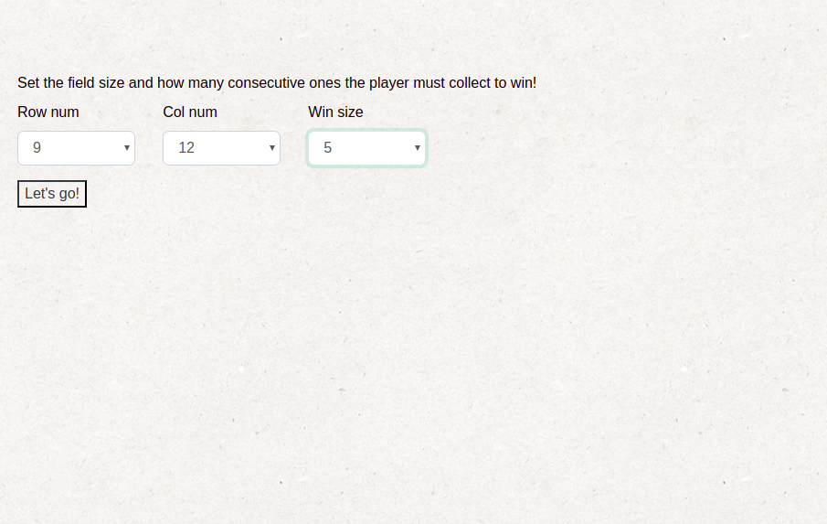
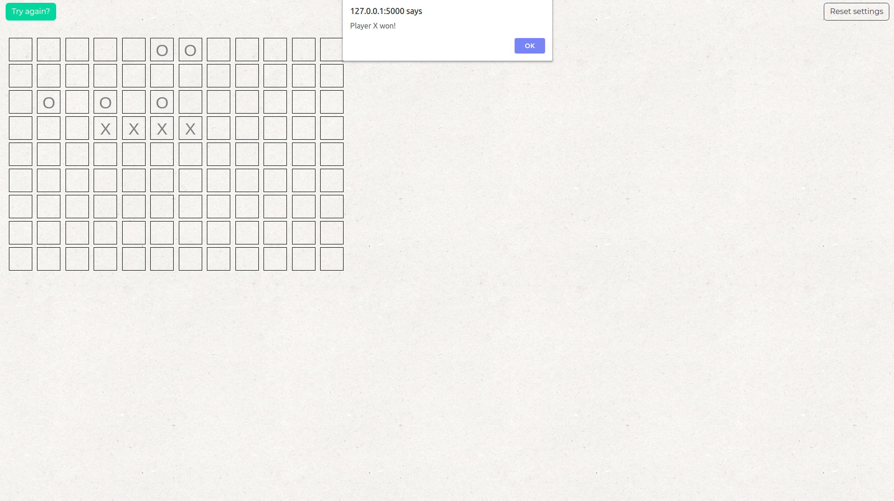

# tic-tac-toe-javascript

Tic Tac Toe game in browser. 

Player can choose horizotal an vertical size of board, which is created dynamically as well as checking winnig conditons which size can also be decided by player.

After a player wins there is a pop-up informing about it and the possibility to play further is blocked. Players can resume game or try it again with different settings.

